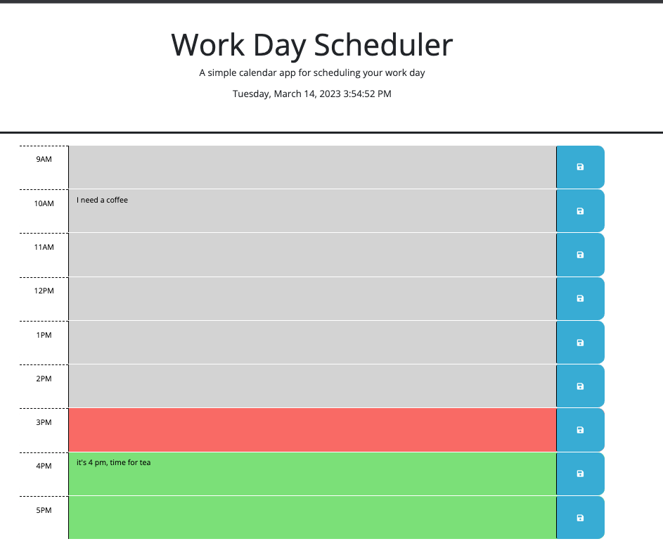
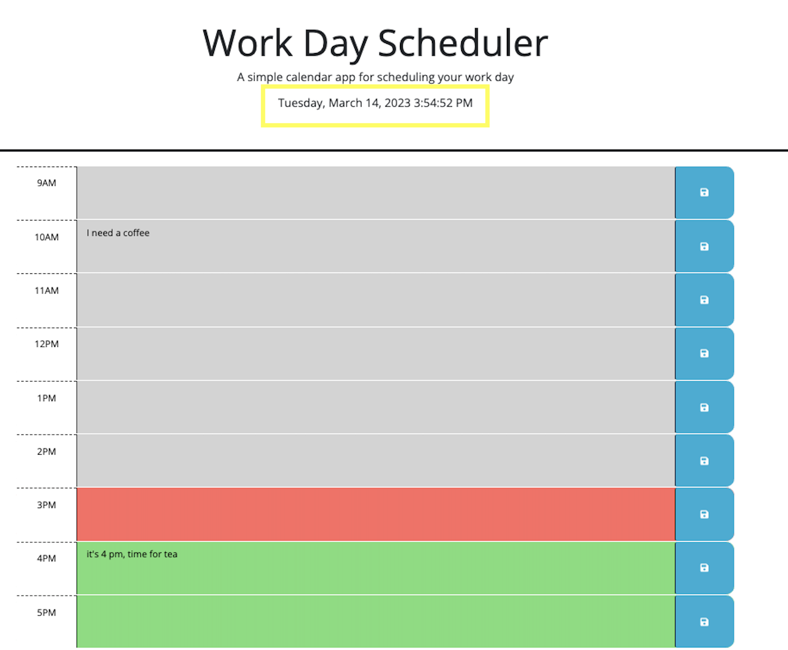
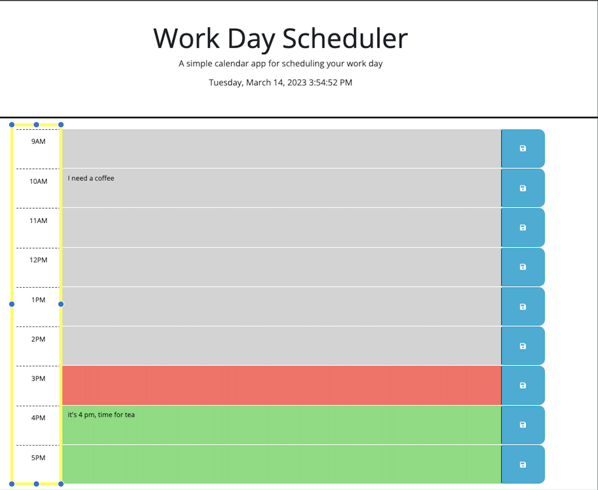
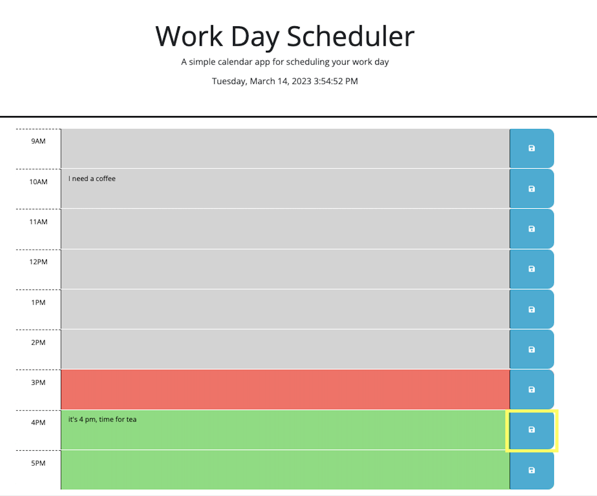
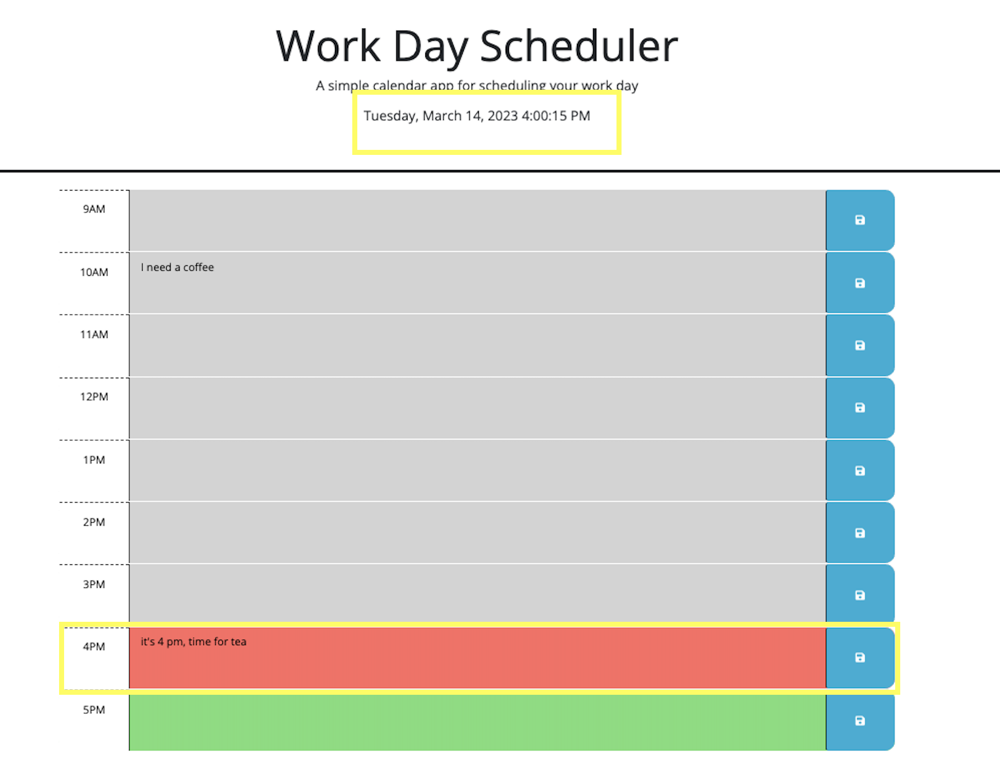

# workday-schedule

## Description

The goal of this project is to visulise a schedule over a day. It allows user to update schedule on hourly bases, by click on the save button, the user is able to save the task to local storage and when the page is refeshed, the task stays there unless the user cleans the input then save. 

Also, this application colour codes the tasks, when the hour is already past, the cell turns into grey; for the ongoing task to fucus on this hour it is red; for future tasks, the colour green is used. 

## Installation

VS code, live server JavaScript, jQuery and dayJS. 

Deployed app link: [https://stevendong2512.github.io/weather/](https://stevendong2512.github.io/workday-schedule/)

## Usage
Overview of the user interface: 

The clock is updated on seconds: 

Each hour is placed before the text cells: 

The Save button is located after the text cells:

When the time is updated, the colours of the cells are also updates accordingly: 

## Credits

Steven Dong

## License

MIT License

Copyright (c) 2023 StevenDong2512

Permission is hereby granted, free of charge, to any person obtaining a copy
of this software and associated documentation files (the "Software"), to deal
in the Software without restriction, including without limitation the rights
to use, copy, modify, merge, publish, distribute, sublicense, and/or sell
copies of the Software, and to permit persons to whom the Software is
furnished to do so, subject to the following conditions:

The above copyright notice and this permission notice shall be included in all
copies or substantial portions of the Software.

THE SOFTWARE IS PROVIDED "AS IS", WITHOUT WARRANTY OF ANY KIND, EXPRESS OR
IMPLIED, INCLUDING BUT NOT LIMITED TO THE WARRANTIES OF MERCHANTABILITY,
FITNESS FOR A PARTICULAR PURPOSE AND NONINFRINGEMENT. IN NO EVENT SHALL THE
AUTHORS OR COPYRIGHT HOLDERS BE LIABLE FOR ANY CLAIM, DAMAGES OR OTHER
LIABILITY, WHETHER IN AN ACTION OF CONTRACT, TORT OR OTHERWISE, ARISING FROM,
OUT OF OR IN CONNECTION WITH THE SOFTWARE OR THE USE OR OTHER DEALINGS IN THE
SOFTWARE.
